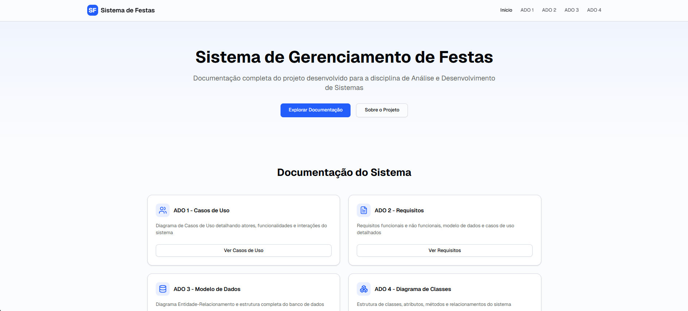

<!-- PORTFOLIO-FEATURED 
title: ADS Site — Sistema de Gerenciamento de Festas (ADO1–ADO4) 
description: Aplicação Next.js com páginas ADO1–ADO4 apresentando requisitos, casos de uso, modelo de dados/classes e protótipo visual, com paleta indigo e suporte a tema escuro. 
technologies: Next.js, React, TypeScript, Tailwind CSS 
demo: https://site-apresentacao-ads.vercel.app/
highlight: true 
image: public/foto.png
-->

<p align="center"> 
   
</p>

# ADS Site — Sistema de Gerenciamento de Festas (ADO1–ADO4)

Projeto Next.js que organiza e apresenta os materiais das ADOs (trabalhos) da disciplina, com páginas dedicadas para requisitos, casos de uso, modelo de dados/classes e protótipo visual. Inclui uma paleta moderna indigo com suporte a tema claro/escuro e um conjunto robusto de componentes UI.

## Visão Geral
- Aplicação em `Next.js` (App Router) com `React` e `TypeScript`.
- UI baseada em `Tailwind CSS v4` com tokens de tema e variante `dark:`.
- Componentes reutilizáveis em `components/ui` (estilo shadcn/ui).
- Conteúdos e artefatos das ADOs disponíveis na pasta `public`.

## Páginas Principais
- `/ado1` — Requisitos e visão geral do sistema.
  - Artefatos: `./public/ADO1.pdf`, `./public/diagrama-casos-de-uso.png`.
- `/ado2` — Casos de uso detalhados.
  - Artefatos: `./public/ADO2.pdf`.
- `/ado3` — Modelo de Dados e Classes do Sistema de Gerenciamento de Festas.
  - Tabela resumo no início da página com Classes, Atributos, Operações e Relacionamentos.
  - Layout responsivo: tabela oculta em telas pequenas e cartões equivalentes exibidos.
  - Artefatos: `./public/ADO3.xlsx`, `./public/diagrama-de-classes.png`, `./public/der.png`.
- `/ado4` — Protótipo e navegação.
  - Artefatos: `./public/ADO4.pdf`.

## Tecnologias
- Next.js (App Router), React 18+, TypeScript
- Tailwind CSS v4, PostCSS
- Componentes UI (estilo shadcn/ui)

## Executando Localmente
Pré-requisitos:
- Node.js 18+ e npm (ou pnpm/yarn)

Instalação e execução:
```bash
# instalar dependências
npm install

# desenvolvimento (porta padrão 3000)
npm run dev
# acesse: http://localhost:3000

# alternativa se a porta 3000 estiver ocupada
npx next dev -p 3002
# acesse: http://localhost:3002
```

Build e produção:
```bash
npm run build
npm run start
# acesse: http://localhost:3000
```

## Scripts (package.json)
- `dev` — inicia o servidor de desenvolvimento
- `build` — constrói a aplicação para produção
- `start` — executa a build em modo produção

## Estrutura do Projeto
```
app/              # rotas e páginas (App Router)
  ado1/
  ado2/
  ado3/
  ado4/
  globals.css     # tokens de tema e diretivas Tailwind v4
  layout.tsx      # layout raiz e metadados (generator: "valentelucass")
components/
  ui/             # componentes reutilizáveis (table, card, button, etc.)
public/           # imagens e PDFs das ADOs
.vscode/settings.json  # ajustes do editor
```

## Design e Tema
- Paleta indigo moderna e minimalista, com tokens definidos em `app/globals.css`.
- Suporte a tema escuro via classes `dark:`.
- Notas do editor: o projeto usa diretivas Tailwind v4 (`@custom-variant`, `@theme`, `@apply`). Para evitar avisos no VSCode, há regras ignoradas em `.vscode/settings.json`.

## Artefatos
- PDFs e imagens das ADOs na pasta `public`:
  - `ADO1.pdf`, `ADO2.pdf`, `ADO3.xlsx`, `ADO4.pdf`
  - `diagrama-casos-de-uso.png`, `diagrama-de-classes.png`, `der.png`

## Observações
- Hot Reload: durante o desenvolvimento, mensagens de `webpack.hot-update` podem aparecer; são comuns e não impedem navegação.
- Recomenda-se a extensão Tailwind CSS IntelliSense para uma melhor DX.

## Créditos
- Gerador/Autor: `valentelucass`
